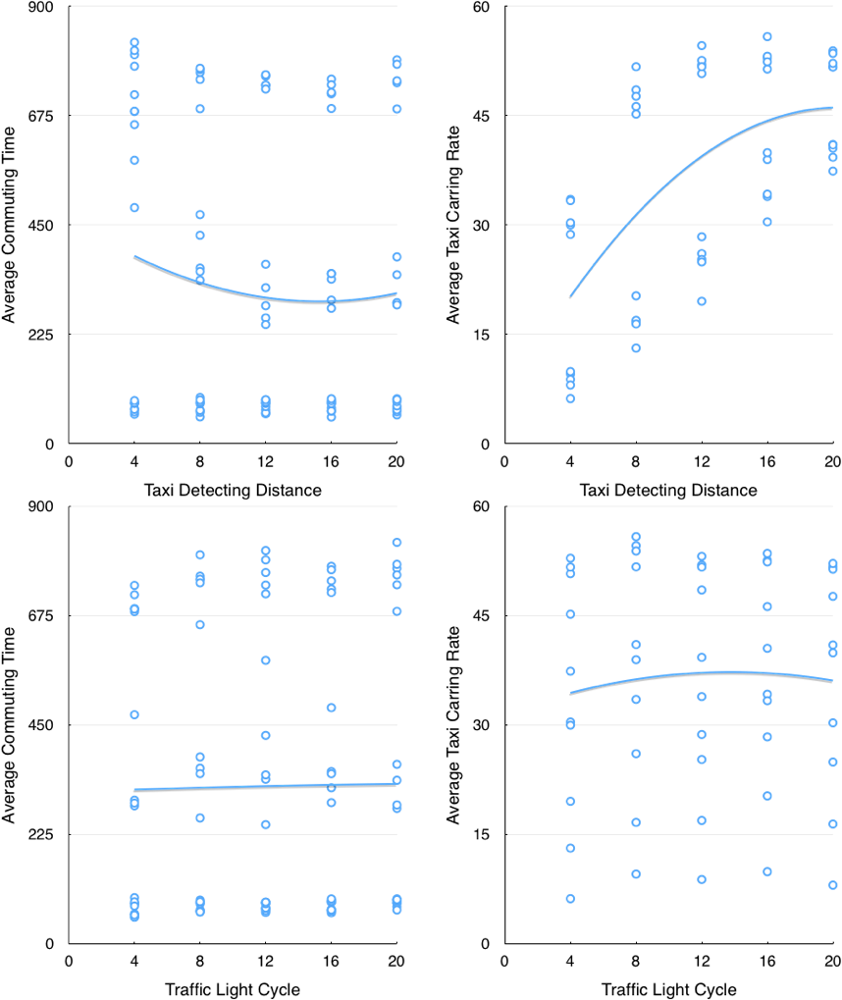

# Urban Transportation System

<!-- toc orderedList:0 depthFrom:1 depthTo:6 -->

* [Urban Transportation System](#urban-transportation-system)
    * [Introduction](#introduction)
        * [Overall](#overall)
        * [Citizen](#citizen)
        * [Vehicle](#vehicle)
        * [Traffic Regulation](#traffic-regulation)
        * [Principle](#principle)
    * [Features](#features)
    * [Interaction](#interaction)
        * [Input](#input)
        * [Output](#output)
        * [Objective](#objective)
    * [Experiment](#experiment)
        * [Purpose](#purpose)
        * [Data](#data)
        * [Analysis](#analysis)
        * [Result](#result)
    * [Simulation](#simulation)
        * [Traffic Jam](#traffic-jam)
    * [Dependency](#dependency)
    * [Implementation](#implementation)
        * [Object](#object)
            * [Agent](#agent)
            * [Environment](#environment)
            * [Link](#link)
        * [Variables](#variables)
        * [Setup](#setup)
        * [Transportation](#transportation)
        * [Interaction](#interaction-1)
            * [Button](#button)
            * [Mouse Click](#mouse-click)
            * [Plot](#plot)
        * [Analysis](#analysis-1)
        * [Algorithm](#algorithm)
    * [Deficiency](#deficiency)
    * [TODO](#todo)

<!-- tocstop -->

This is an urban transportation system simulating citizens’ commuting by private cars, taxies and buses. The model reveals the importance of public traffic.


## Introduction
### Overall
The whole city is presented as grid. It is composed of different kinds of patches: land, idle-estate, residence, company, road and bus-stop.

The model contains four subdivision systems: citizens, taxies, buses and traffic lights. User can manipulate this transportation system by setting global variables in the beginning or regulating the number of taxies and creating bus lines during the simulation.

### Citizen
Every citizen has its own residence and company. The citizen's goal is to move back and forth between his residence and his company as quickly as possible. If the citizen has a private car, then he commutes by his own car. Otherwise, he either takes taxi if there exists idle one nearby or takes bus.

### Vehicle
All vehicles are running in the two-lane roads and abide by the traffic lights. Vehicles will decelerate when there are other vehicles or red light ahead, or accelerate until reaching the max speed in other situations.

Taxies travel randomly from house to house when idle and buses are driven alongside their bus lines continuously. One taxi can only carry one passenger, meanwhile, one bus can carry up to 4 passengers.

### Traffic Regulation
Traffic lights switch periodically.

### Principle
Whether citizens are able to reach the destination as soon as possible depends on the reasonable planning of public traffic and fewer traffic congestion. User can learn about the utilization of public traffic (taxies and buses) and average commuting time by observing real-time graphical data.

## Features
Citizens in this model use both utility-based cognition and goal-based cognition.

## Interaction
### Input
Whole system will be initialized after SETUP button is pressed. After that, user can press the GO button to start the system.

Taxies can be added by ADD TAXI button. Bus lines can be created by clicking two different road patches when system is running.

There are four sliders for global variables:
```
initial-people-num   -- Initial number of citizens
taxi-detect-distance -- How far can available taxies be detected by passengers
has-car-ratio        -- Proportion of citizens who has a private car
traffic-light-cycle  -- Traffic light switching cycle
```

### Output
There are three real-time plots:
```
Average Taxi Carrying Rate  -- displays the proportion of taxies with passenger over time
Average Bus Carrying Number -- displays the average number of passengers on each bus over time
Average Commuting Time      -- displays the average time of each commuting
```
Plots update every 10 ticks and record the mean value of past 100 ticks. Therefore the lines are smooth.

### Objective
User should schedule public traffic well so that citizens don't have to walk all the way to the destination which is pretty inefficient and empty loading rate should be reduced to avoid redundant vehicles causing traffic jams.

## Experiment
### Purpose
Using BehaviorSpace to find the most efficient taxi-detect-distance and traffic-light-cycle to maximize the Average Taxi Carrying Rate and minimize the Average Commuting Time.
### Data
The preprocessed data in CSV format can be found [here](res/experiment.csv).
### Analysis
The analyzed experiment results are as follows:


### Result
The preferred taxi-detect-distance is 15 and traffic-light-cycle is 14.

## Simulation
### Traffic Jam
Traffic congestion in downtown is more severe than suburb.


## Dependency
[NetLogo 6.0.1](http://ccl.northwestern.edu/netlogo/download.shtml)

## Implementation
The program is made up of the following six parts.

### Object
#### Agent
- Model: citizen, bus, taxi
- View: mapping-citizen, mapping-bus, mapping-taxi
- Algorithm: vertex
- Transportation: bus-stop

#### Environment
```
Land        -- deeper brown
Idle-estate -- deep brown
Residence   -- yellow
Company     -- blue
Road        -- light gray
Red light   -- red
Green light -- green
```

#### Link
- map-link: link model agent with view agent
- bus-link and taxi-link: tie the passenger and the vehicle
- edge: used in the graph algorithm

### Variables
Define global and object variables.

### Setup
Initialize variables, patches, estates, map and citizens.

### Transportation
Iterate citizens, taxies, buses and traffic lights every turn.

### Interaction
#### Button
Add taxi or citizen.

#### Mouse Click
Add bus line.

#### Plot
Display the graphical output.

### Analysis
Record data and update plots.

### Algorithm
There is a graph for algorithm use corresponding to the city grid UI.
Every time an agent wants to know a path from origin to destination, the program runs Dijkstra Algorithm to find the shortest path.

## Deficiency
- Limited by the implementation and language capacity, detecting vehicles ahead is troublesome which makes animation of acceleration and deceleration coarse
- Since agents don't take up space in NetLogo but their images do, images may overlap, which looks like an traffic collision
- Limited by the implementation of two-lane road, traffic light is not bidirectional and turning animation seems abrupt

## TODO
- More accurate experiment can be performed
